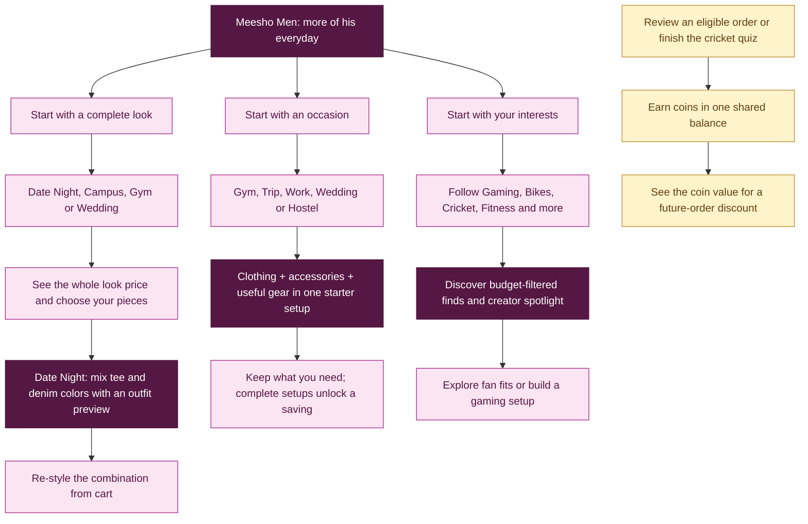

# Meesho DICE Challenge 3.0 | Team hpgirls | IIT Guwahati

### [LIVE PROTOTYPE ↗](https://meesho-men.netlify.app/) · [PRESENTATION ↗](https://canva.link/yfjqut3h195by7w) · [DEMO VIDEO ↗](https://www.youtube.com/shorts/5ikRYYUXJGo)

Problem Statement- Winning Male Users on Meesho
## Our Solution
**Meesho Men** is a user-friendly mobile-first shopping prototype that brings affordable complete looks, occasion-based setups, and interest-led discovery into one experience. Built for Meesho DICE 3.0, it explores how the platform can become more relevant to men's everyday needs.

## The idea

**More categories. More use cases. More of his everyday.**

Instead of searching for every item separately, users can begin with an outfit, an occasion, or an interest. Meesho Men connects fashion with accessories, sports, gaming, tech, and utility essentials to help users put together a complete look or setup within their budget.

## From a look, a plan, or a passion to a complete setup



The experience combines **affordable styling**, **cross-category occasion setups**, and **interest-led discovery**. Coins connect review and quiz engagement to a future-order discount proposition.

## What makes it different

### Complete looks, made personal

**Shop the Look** presents Date Night Ready, Campus Main Character, Gym Mode On, and Wedding Guest Energy with an upfront combined price. Users can inspect each piece and choose only what they need through **Customize Look**.

Date Night Ready adds **color mix-and-match**: pair red/yellow T-shirts with blue/black jeans and preview the complete outfit. The combination can also be changed from cart without losing selected sizes or quantities.

### Shopping around real plans

**Shop by Occasion** brings together products for Gym, Trip, Work, Wedding, and Hostel. Starter setups combine clothing with useful gear and accessories, with a demo saving for the complete bundle. Quick Shop shortcuts help users move from a plan to a relevant collection.

### Discovery shaped by interests

**Trendy** lets users follow Bikes, Gaming, Cricket, Football, Fitness, Streetwear, and Tech. Budget filters narrow the resulting feed, while Creator Spotlight connects sample outfit and gaming videos to shopping journeys.

**Sports** adds customizable fan-inspired jersey looks, cricket equipment, an occasional quiz, and a sample scorecard that can be pinned to Home. **Gaming Corner** provides dedicated controls, audio, and desk-setup discovery.

### Choice across budgets

The Men tab offers price filters and **Because you previously viewed** recommendations. **Meesho Gold** provides a separate premium collection for users looking for an upgrade.

Smart Review summaries, selected **Rarely returned** signals, and **Google Lens image comparison** help users explore purchase confidence and similar listings.

### Engagement through Coins

The Coins section brings review and quiz earnings into one balance with an earning history. A recent-order review can earn coins, while an expired earning window still allows feedback without a reward.

**Refer & Earn** sits inside cart, with referral rewards tied to delivery and return-window closure. See [reward economics](docs/COINS_FINANCIAL_ANALYSIS.txt) for the model and assumptions, or [the feature list](docs/FEATURES.txt) for individual descriptions.

## Run locally

1. Download or clone the repository.
2. Open `index.html` in Chrome or Edge.
3. Keep the `assets` folder beside `index.html`.

No installation or build step is required. Internet access is needed for remote product images and Google Lens.

## Repository structure

```text
index.html       App interface, styling, catalogue, and interactions
assets/          Product images, outfit previews, and sample videos
docs/            Feature descriptions and reward economics
tests/           Shopping and reward flow checks
```

Built with **HTML, CSS, and JavaScript**, using browser local storage for interests, recent views, and reward history. Optional checks: `node tests/validate.cjs`.

*This is a competition prototype, not an official Meesho product. Product data, rewards, scores, and creator footage are illustrative; transactions are simulated.*

## Team hpgirls

- **Mansi Sharma**
- **Shreya Paul**
- **Kritika Shree**
